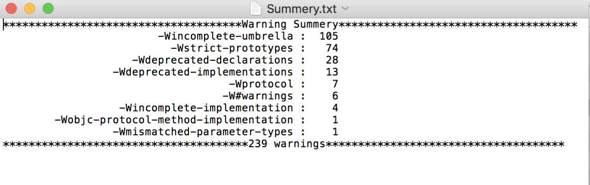

# IssueAnalyzer
IssueAnalyzer is a tool to alanyze Xcode build or compile log.

___

### Usage

* Select log file
* Click Analyze
* Check the summry.txt or Waring.md. 

___
***The below picture is Summery.txt***
